# Sơ Đồ Use Case - Hệ Thống Web Bán Pizza

## Mô tả hệ thống
Hệ thống web bán pizza cho phép khách hàng đặt hàng trực tuyến và admin quản lý đơn hàng, sản phẩm.

## Sơ đồ Use Case (Mermaid)

```mermaid
graph TB
    subgraph "HỆ THỐNG WEB BÁN PIZZA"
        
        subgraph "Quản lý Tài khoản"
            UC1[Đăng ký tài khoản]
            UC2[Đăng nhập]
            UC3[Quản lý thông tin cá nhân]
            UC4[Đổi mật khẩu]
        end
        
        subgraph "Quản lý Sản phẩm - Khách hàng"
            UC5[Xem danh sách sản phẩm]
            UC6[Xem chi tiết sản phẩm]
            UC7[Tìm kiếm sản phẩm]
            UC8[Lọc sản phẩm theo danh mục]
            UC9[Thêm vào Wishlist]
            UC10[Xem Wishlist]
        end
        
        subgraph "Quản lý Giỏ hàng"
            UC11[Thêm sản phẩm vào giỏ]
            UC12[Xem giỏ hàng]
            UC13[Cập nhật số lượng]
            UC14[Xóa sản phẩm khỏi giỏ]
            UC15[Chọn size pizza]
            UC16[Chọn tất cả sản phẩm]
        end
        
        subgraph "Quản lý Đơn hàng - Khách hàng"
            UC17[Đặt hàng]
            UC18[Chọn phương thức thanh toán]
            UC19[Xem lịch sử đơn hàng]
            UC20[Xem chi tiết đơn hàng]
        end
        
        subgraph "Liên hệ"
            UC21[Gửi liên hệ]
            UC22[Xem thông tin về chúng tôi]
        end
        
        subgraph "Admin - Quản lý Sản phẩm"
            UC23[Thêm sản phẩm]
            UC24[Sửa sản phẩm]
            UC25[Xóa sản phẩm]
            UC26[Upload hình ảnh sản phẩm]
        end
        
        subgraph "Admin - Quản lý Danh mục"
            UC27[Thêm danh mục]
            UC28[Sửa danh mục]
            UC29[Xóa danh mục]
            UC30[Quản lý danh mục con]
        end
        
        subgraph "Admin - Quản lý Đơn hàng"
            UC31[Xem danh sách đơn hàng]
            UC32[Xem chi tiết đơn hàng]
            UC33[Cập nhật trạng thái đơn]
            UC34[In hóa đơn]
            UC35[Hủy đơn hàng]
        end
        
        subgraph "Admin - Quản lý Khách hàng"
            UC36[Xem danh sách khách hàng]
            UC37[Xem chi tiết khách hàng]
            UC38[Xóa khách hàng]
        end
        
        subgraph "Admin - Quản lý Liên hệ"
            UC39[Xem danh sách liên hệ]
            UC40[Xem chi tiết liên hệ]
            UC41[Xóa liên hệ]
        end
        
        subgraph "Admin - Dashboard"
            UC42[Xem thống kê tổng quan]
            UC43[Xem báo cáo doanh thu]
            UC44[Xem sản phẩm bán chạy]
        end
    end
    
    Customer((Khách hàng))
    Admin((Admin))
    
    Customer -.-> UC1
    Customer -.-> UC2
    Customer -.-> UC3
    Customer -.-> UC4
    
    Customer -.-> UC5
    Customer -.-> UC6
    Customer -.-> UC7
    Customer -.-> UC8
    Customer -.-> UC9
    Customer -.-> UC10
    
    Customer -.-> UC11
    Customer -.-> UC12
    Customer -.-> UC13
    Customer -.-> UC14
    Customer -.-> UC15
    Customer -.-> UC16
    
    Customer -.-> UC17
    Customer -.-> UC19
    Customer -.-> UC20
    
    Customer -.-> UC21
    Customer -.-> UC22
    
    Admin -.-> UC2
    Admin -.-> UC23
    Admin -.-> UC24
    Admin -.-> UC25
    Admin -.-> UC26
    
    Admin -.-> UC27
    Admin -.-> UC28
    Admin -.-> UC29
    Admin -.-> UC30
    
    Admin -.-> UC31
    Admin -.-> UC32
    Admin -.-> UC33
    Admin -.-> UC34
    
    Admin -.-> UC36
    Admin -.-> UC37
    Admin -.-> UC38
    
    Admin -.-> UC39
    Admin -.-> UC40
    Admin -.-> UC41
    
    Admin -.-> UC42
    Admin -.-> UC43
    Admin -.-> UC44
    
    %% INCLUDE relationships (bắt buộc)
    UC5 -->|include| UC8
    UC5 -->|include| UC7
    UC6 -->|include| UC9
    UC12 -->|include| UC13
    UC12 -->|include| UC14
    UC12 -->|include| UC16
    UC17 -->|include| UC18
    UC31 -->|include| UC32
    UC23 -->|include| UC26
    UC24 -->|include| UC26
    
    %% EXTEND relationships (tùy chọn)
    UC11 -.->|extend| UC15
    UC13 -.->|extend| UC16
    UC20 -.->|extend| UC10
    UC33 -.->|extend| UC35
    UC32 -.->|extend| UC34
```



## Chi tiết Use Cases

### 1. Khách hàng (Customer)

#### Quản lý Tài khoản
- **UC1: Đăng ký tài khoản** - Khách hàng tạo tài khoản mới với email, mật khẩu, số điện thoại, địa chỉ
- **UC2: Đăng nhập** - Khách hàng đăng nhập vào hệ thống
- **UC3: Quản lý thông tin cá nhân** - Cập nhật tên, số điện thoại, địa chỉ
- **UC4: Đổi mật khẩu** - Thay đổi mật khẩu đăng nhập

#### Quản lý Sản phẩm
- **UC5: Xem danh sách sản phẩm** - Xem tất cả sản phẩm (Pizza, Gà, Mỳ Ý, Khai vị, Tráng miệng, Thức uống)
- **UC6: Xem chi tiết sản phẩm** - Xem mô tả, giá, hình ảnh chi tiết sản phẩm
- **UC7: Tìm kiếm sản phẩm** - Tìm kiếm theo tên sản phẩm
- **UC8: Lọc sản phẩm theo danh mục** - Lọc Pizza, Gà, Mỳ Ý, v.v.
- **UC9: Thêm vào Wishlist** - Đánh dấu sản phẩm yêu thích
- **UC10: Xem Wishlist** - Xem danh sách sản phẩm đã lưu

#### Quản lý Giỏ hàng
- **UC11: Thêm sản phẩm vào giỏ** - Thêm sản phẩm với size và số lượng
- **UC12: Xem giỏ hàng** - Xem danh sách sản phẩm trong giỏ
- **UC13: Cập nhật số lượng** - Tăng/giảm số lượng sản phẩm
- **UC14: Xóa sản phẩm khỏi giỏ** - Xóa sản phẩm không mua
- **UC15: Chọn size pizza** - Chọn size Nhỏ/Vừa/Lớn cho pizza
- **UC16: Chọn tất cả sản phẩm** - Chọn/bỏ chọn tất cả sản phẩm trong giỏ

#### Quản lý Đơn hàng
- **UC17: Đặt hàng** - Tạo đơn hàng từ giỏ hàng
- **UC18: Chọn phương thức thanh toán** - Chọn Trực tiếp hoặc Chuyển khoản
- **UC19: Xem lịch sử đơn hàng** - Xem các đơn đã đặt
- **UC20: Xem chi tiết đơn hàng** - Xem thông tin chi tiết từng đơn

#### Liên hệ
- **UC21: Gửi liên hệ** - Gửi thông tin liên hệ, góp ý cho admin
- **UC22: Xem thông tin về chúng tôi** - Xem giới thiệu về cửa hàng

### 2. Admin (Quản trị viên)

#### Quản lý Sản phẩm
- **UC23: Thêm sản phẩm** - Tạo sản phẩm mới (tên, mô tả, giá, hình ảnh, danh mục)
- **UC24: Sửa sản phẩm** - Cập nhật thông tin sản phẩm
- **UC25: Xóa sản phẩm** - Xóa sản phẩm khỏi hệ thống
- **UC26: Upload hình ảnh sản phẩm** - Tải ảnh lên cho sản phẩm

#### Quản lý Danh mục
- **UC27: Thêm danh mục** - Tạo danh mục sản phẩm mới
- **UC28: Sửa danh mục** - Cập nhật tên, mô tả danh mục
- **UC29: Xóa danh mục** - Xóa danh mục
- **UC30: Quản lý danh mục con** - Quản lý danh mục cấp 2 (Siêu Toppings, Đại tiệc hải sản, v.v.)

#### Quản lý Đơn hàng
- **UC31: Xem danh sách đơn hàng** - Xem tất cả đơn hàng trong hệ thống
- **UC32: Xem chi tiết đơn hàng** - Xem thông tin chi tiết đơn hàng
- **UC33: Cập nhật trạng thái đơn** - Chuyển trạng thái: Chờ xác nhận → Đã xác nhận → Đang giao → Đã giao
- **UC34: In hóa đơn** - In hóa đơn cho đơn hàng
- **UC35: Hủy đơn hàng** - Đổi trạng thái sang "Đã hủy"

#### Quản lý Khách hàng
- **UC36: Xem danh sách khách hàng** - Xem tất cả khách hàng đã đăng ký
- **UC37: Xem chi tiết khách hàng** - Xem thông tin chi tiết khách hàng
- **UC38: Xóa khách hàng** - Xóa tài khoản khách hàng

#### Quản lý Liên hệ
- **UC39: Xem danh sách liên hệ** - Xem tất cả tin nhắn liên hệ
- **UC40: Xem chi tiết liên hệ** - Xem nội dung chi tiết tin nhắn
- **UC41: Xóa liên hệ** - Xóa tin nhắn liên hệ

#### Dashboard
- **UC42: Xem thống kê tổng quan** - Xem tổng quan doanh thu, đơn hàng
- **UC43: Xem báo cáo doanh thu** - Xem báo cáo chi tiết doanh thu
- **UC44: Xem sản phẩm bán chạy** - Xem top sản phẩm bán nhiều nhất

## Luồng Use Case chính

### Luồng 1: Khách hàng đặt hàng
```
1. Khách hàng đăng nhập (UC2)
2. Xem danh sách sản phẩm (UC5)
3. Xem chi tiết sản phẩm (UC6)
4. Thêm sản phẩm vào giỏ (UC11)
5. Chọn size pizza (UC15)
6. Xem giỏ hàng (UC12)
7. Cập nhật số lượng (UC13)
8. Đặt hàng (UC17)
9. Chọn phương thức thanh toán (UC18)
10. Hoàn tất đơn hàng
```

### Luồng 2: Admin xử lý đơn hàng
```
1. Admin đăng nhập (UC2)
2. Xem danh sách đơn hàng (UC31)
3. Xem chi tiết đơn hàng (UC32)
4. Cập nhật trạng thái: Chờ xác nhận → Đã xác nhận (UC33)
5. Cập nhật trạng thái: Đã xác nhận → Đang giao (UC33)
6. Cập nhật trạng thái: Đang giao → Đã giao (UC33)
7. In hóa đơn (UC34)
```

### Luồng 3: Admin quản lý sản phẩm
```
1. Admin đăng nhập (UC2)
2. Thêm danh mục (UC27)
3. Thêm sản phẩm (UC23)
4. Upload hình ảnh (UC26)
5. Cập nhật thông tin sản phẩm (UC24)
```

## Ghi chú kỹ thuật

### Actors (Tác nhân)
1. **Khách hàng (Customer)** - Người dùng cuối mua hàng
2. **Admin (Administrator)** - Quản trị viên hệ thống

### Quan hệ giữa Use Cases

#### 1. INCLUDE Relationships (Bắt buộc - luôn thực hiện)

| Use Case | Include | Mô tả |
|----------|---------|-------|
| **UC5: Xem danh sách sản phẩm** | → UC8: Lọc theo danh mục | Khi xem danh sách luôn có tùy chọn lọc theo danh mục |
| **UC5: Xem danh sách sản phẩm** | → UC7: Tìm kiếm sản phẩm | Khi xem danh sách luôn có tùy chọn tìm kiếm |
| **UC6: Xem chi tiết sản phẩm** | → UC9: Thêm vào Wishlist | Khi xem chi tiết luôn có nút thêm vào wishlist |
| **UC12: Xem giỏ hàng** | → UC13: Cập nhật số lượng | Khi xem giỏ hàng luôn có nút +/- để cập nhật số lượng |
| **UC12: Xem giỏ hàng** | → UC14: Xóa sản phẩm | Khi xem giỏ hàng luôn có nút xóa sản phẩm |
| **UC12: Xem giỏ hàng** | → UC16: Chọn tất cả sản phẩm | Khi xem giỏ hàng luôn có nút chọn tất cả |
| **UC17: Đặt hàng** | → UC18: Chọn phương thức thanh toán | Khi đặt hàng bắt buộc phải chọn phương thức thanh toán (Trực tiếp/Chuyển khoản) |
| **UC31: Xem danh sách đơn hàng** | → UC32: Xem chi tiết đơn hàng | Khi xem danh sách đơn, admin có thể xem chi tiết từng đơn |
| **UC23: Thêm sản phẩm** | → UC26: Upload hình ảnh sản phẩm | Khi thêm sản phẩm bắt buộc phải upload hình ảnh |
| **UC24: Sửa sản phẩm** | → UC26: Upload hình ảnh sản phẩm | Khi sửa sản phẩm có thể upload hình ảnh mới |

#### 2. EXTEND Relationships (Tùy chọn - thực hiện trong trường hợp đặc biệt)

| Use Case | Extend | Mô tả | Điều kiện |
|----------|--------|-------|----------|
| **UC11: Thêm sản phẩm vào giỏ** | ←← UC15: Chọn size pizza | Khi thêm sản phẩm pizza, khách hàng có tùy chọn chọn size (Nhỏ/Vừa/Lớn) | Chỉ khi sản phẩm là Pizza |
| **UC13: Cập nhật số lượng** | ←← UC16: Chọn tất cả sản phẩm | Khi cập nhật số lượng từng sản phẩm, có tùy chọn chọn/bỏ chọn tất cả | Tùy chọn hỗ trợ |
| **UC20: Xem chi tiết đơn hàng** | ←← UC10: Xem Wishlist | Từ chi tiết đơn hàng khách hàng có thể xem wishlist của mình | Tùy chọn hỗ trợ |
| **UC33: Cập nhật trạng thái đơn** | ←← UC35: Hủy đơn hàng | Admin có tùy chọn hủy đơn hàng khi cập nhật trạng thái | Trạng thái không phải "Đã giao" |
| **UC32: Xem chi tiết đơn hàng** | ←← UC34: In hóa đơn | Từ chi tiết đơn hàng admin có tùy chọn in hóa đơn | Bất cứ lúc nào |

### Trạng thái đơn hàng
1. Chờ xác nhận (mặc định)
2. Đã xác nhận
3. Đang giao
4. Đã giao (terminal state)
5. Đã hủy (terminal state)

### Size Pizza
- Nhỏ
- Vừa
- Lớn

### Phương thức thanh toán
- Trực tiếp (COD)
- Chuyển khoản

## Database Tables liên quan

- **users** - Lưu thông tin khách hàng
- **admin** - Lưu thông tin admin
- **products** - Lưu sản phẩm
- **categories** - Lưu danh mục (có hỗ trợ danh mục con)
- **orders** - Lưu đơn hàng
- **order_items** - Lưu chi tiết sản phẩm trong đơn
- **wishlists** - Lưu sản phẩm yêu thích
- **contacts** - Lưu tin nhắn liên hệ

---

**Lưu ý**: Để xem sơ đồ Mermaid được render, bạn có thể:
1. Sử dụng VS Code với extension Markdown Preview Mermaid Support
2. Upload file lên GitHub (GitHub tự động render Mermaid)
3. Sử dụng các công cụ online như mermaid.live
